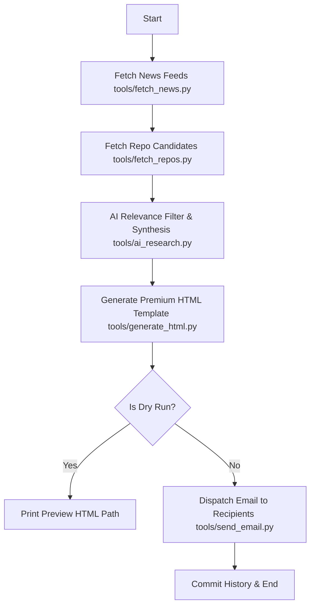

# Workflow: Daily BUILDR.ai Technical Briefing

This Standard Operating Procedure (SOP) outlines the execution protocol for generating and dispatching the daily technical newsletter.

## Objective
To deliver a high-signal, developer-centric newsletter structured into 5 core sections:
1. Launches (Models, Tools, APIs, Products)
2. Prompting & Technique (Practical Patterns)
3. Head to Head (Comparisons & Tradeoffs)
4. Tech Shifts (Infrastructure & Platform Changes)
5. Repo Radar (Featured Open-Source GitHub Repositories)

## Schedule
*   **Trigger Time**: Exactly 02:30 UTC daily (08:00 AM IST) via GitHub Actions workflow (`daily_newsletter.yml`).

## Required Inputs & Environment
Ensure the following variables are configured in `.env` or GitHub Secrets:
- `PERPLEXITY_API_KEY`: API Key for Perplexity AI.
- `RECIPIENT_EMAIL`: Single email address or comma-separated list of recipients.
- `GMAIL_SMTP_EMAIL`: Sender email address for SMTP.
- `GMAIL_SMTP_PASSWORD`: Sender App Password for SMTP.
- `GITHUB_TOKEN`: Provided automatically in GitHub Actions for GitHub REST API authentication.

## Execution Sequence

### 1. Raw News Retrieval
*   **Script**: `tools/fetch_news.py`
*   **Function**: Queries Hacker News (top, new, show) and curated AI/tooling RSS feeds.
*   **Output**: Saves `raw_news.json` in `.tmp/`.

### 2. GitHub Repository Candidate Retrieval
*   **Script**: `tools/fetch_repos.py`
*   **Function**: Queries GitHub REST Search API for trending AI/LLM repos and devtools, excluding repos featured within the last 60 days.
*   **Output**: Saves `raw_repos.json` in `.tmp/`.

### 3. AI Synthesis & Filtering
*   **Script**: `tools/ai_research.py`
*   **Function**: Uses Perplexity API (`sonar`) with structured `json_schema` to synthesize candidates across the 5 sections. Validates repo data and updates `history/featured_repos.json` and `history/featured_articles.json`.
*   **Output**: Saves `synthesized_news.json` in `.tmp/`.

### 4. HTML Rendering
*   **Script**: `tools/generate_html.py`
*   **Function**: Generates responsive table structure formatted for Gmail and Outlook, skipping empty sections.
*   **Output**: Saves `newsletter.html` in `.tmp/`.

### 5. Dispatch / Dry-Run
*   **Script**: `tools/send_email.py`
*   **Function**: Authenticates via Gmail SMTP and transmits HTML payload to all envelope recipients (To: sender). Exits non-zero if synthesized JSON contains zero items.

---

## Error Handling & Troubleshooting

*   **API Failure / Empty Response**: If Perplexity API fails or returns zero items, `ai_research.py` exits with status code 1. The pipeline halts immediately and no email is sent.
*   **Missing Credentials**: Missing `PERPLEXITY_API_KEY`, `RECIPIENT_EMAIL`, or SMTP credentials will cause the respective tool to print a critical error and exit non-zero.
*   **Dry-Run Mode**: Passing `--dry-run` to `run_newsletter.py` generates `.tmp/newsletter.html` without triggering `send_email.py`.
