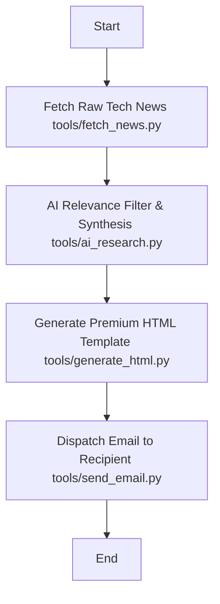

# Workflow: Daily AI & Systems Newsletter

This Standard Operating Procedure (SOP) outlines the execution protocol for generating and dispatching the daily technical newsletter.

## Objective
To deliver a high-signal, custom-curated, and visually stunning newsletter summarizing the latest news, research, and technical blogs in:
1. Artificial Intelligence / Machine Learning
2. Computer Networks
3. Computer Systems Design & Architecture

## Schedule
*   **Trigger Time**: Exactly 6:00 AM daily (configured via CI/CD trigger / GitHub Actions).

## Required Inputs & Environment
Ensure the following variables are configured in the `.env` file or environment:
- `PERPLEXITY_API_KEY`: API Key for Perplexity AI.
- `RECIPIENT_EMAIL`: Recipient Gmail address.
- `GMAIL_SMTP_EMAIL`: Sender email address (if using SMTP).
- `GMAIL_SMTP_PASSWORD`: Sender App Password (if using SMTP).

## Execution Sequence

### 1. Raw Information Retrieval
*   **Script**: `tools/fetch_news.py`
*   **Function**: Queries Hacker News top/new items, arXiv CS feeds, and key RSS endpoints.
*   **Output**: Saves `raw_news.json` in the `.tmp/` directory.

### 2. AI Synthesis and Filtering
*   **Script**: `tools/ai_research.py`
*   **Function**: Uses Perplexity API to evaluate relevance. Parses top articles, summaries, and writes technical deep-dives ("What it is", "Technical Deep-Dive", and "Why It Matters").
*   **Output**: Saves `synthesized_news.json` in the `.tmp/` directory.

### 3. HTML Rendering
*   **Script**: `tools/generate_html.py`
*   **Function**: Generates inline CSS responsive table structure formatted for Gmail.
*   **Output**: Saves `newsletter.html` in the `.tmp/` directory.

### 4. Dispatch
*   **Script**: `tools/send_email.py`
*   **Function**: Authenticates via Gmail SMTP (or Gmail API) and transmits the HTML payload.

---

## Error Handling & Troubleshooting

*   **API Rate Limit / Failure**: If the Perplexity API request fails, wait 30 seconds and retry. If it fails continuously, send a fallback email notifying the user of the pipeline delay.
*   **Empty Raw Feed**: If no articles are fetched (network error/API offline), log an error and attempt to fallback to top Hacker News general items.
*   **Authentication Issues**: Ensure your Google App Password is a 16-character string generated for Gmail, not your main account password.
